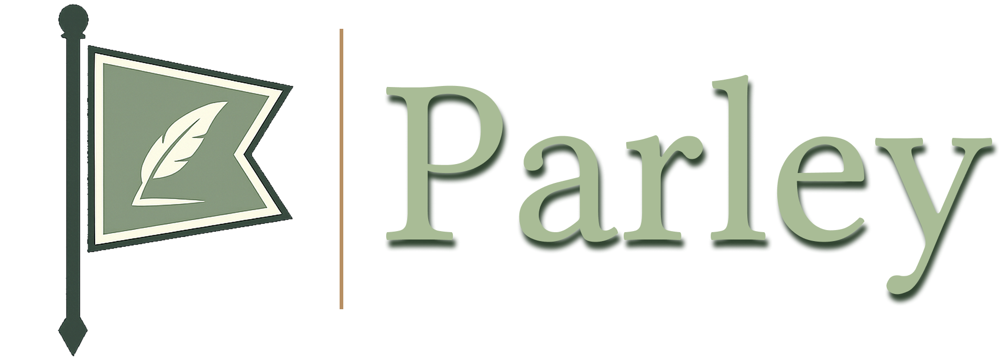

<p align="center">
  
</p>

<p align="center">
  <strong>Recovery-first coordination state for AI agents that need durable continuity beyond chat history.</strong>
</p>

<p align="center">
  Parley gives long-running agents durable identity, obligations, plans, artifacts, effects, and guidance.
</p>

<p align="center">
  <a href="https://www.npmjs.com/package/@nkuhanas/parley">
    
  </a>
  
  
  
</p>

<p align="center">
  <a href="#why-parley-exists">Why Parley exists</a>
  ·
  <a href="#what-parley-is">What Parley is</a>
  ·
  <a href="#runtime-support-today">Runtimes</a>
  ·
  <a href="#install">Install</a>
  ·
  <a href="#quick-start">Quick start</a>
  ·
  <a href="#core-surfaces">Core surfaces</a>
  ·
  <a href="./docs/getting-started.md">Docs</a>
</p>

---

## Why Parley exists

Agents lose continuity when work spans restarts, context compaction, multiple workers, multiple machines, or human review.

Chat history is a useful working surface, but it is not a safe coordination store. When an agent wakes up cold, it still needs reliable answers to practical questions:

- Who am I in this project?
- What boards can I access?
- What work needs my action?
- What changed, who recorded it, and why?
- Which artifacts, effects, and obligations already exist?
- How do I safely resume after losing context?

Parley exists so those answers live in durable coordination state instead of being reconstructed from memory, chat scrollback, or guesswork.

## What Parley is

Parley is a coordination backend for long-running and multi-agent workflows. It records durable identity, obligations, artifacts, effects, relationships, plan lifecycle state, and recovery guidance while your harness continues to run agents, models, tools, sandboxes, and host permissions.

```text
Agent runtime / harness
 |
 | tools / CLI / HTTP
 v
Parley adapter or client
 |
 v
Parley service / local store
 |
 v
Boards, plans, artifacts, effects, obligations, triggers, relationships
```

A caller does not gain project authority merely by invoking a tool: Parley resolves the caller, checks board membership, checks board-local permissions, and fails closed when identity or scope is ambiguous.

Parley's main design bias is recovery over orchestration. Tool responses include summaries, diagnostics, guidance, scoped identifiers, and valid next actions so agents can recover from durable state instead of carrying the whole coordination protocol in prompt context.

## Runtime support today

Parley is harness-agnostic at the core/service boundary, but the most complete adapter today is OpenClaw.

| Surface | Status | Use when |
|---|---|---|
| OpenClaw | Primary adapter | You want full plugin/tool integration through `plugin.js` and ClawHub |
| Codex CLI | Wrapper-supported | You want Codex workers to receive Parley client-mode environment through `parley-codex` |
| CLI / HTTP / JavaScript package | Supported | You want custom scripts or services to call Parley directly |
| Other agent harnesses | Integration path, not first-class adapters yet | You can provide caller identity and call the service/API, but polished adapters are future work |

That means the current user experience is OpenClaw-first, while the coordination model and service boundary are intentionally not OpenClaw-owned. See `docs/supported-runtimes.md` for the integration contract.

## Install

### OpenClaw / ClawHub

Install Parley as an OpenClaw plugin from ClawHub:

```sh
openclaw plugins install clawhub:@nkuhanas/parley
```

### npm / CLI / service

Install the npm package directly when you want the JavaScript API, CLI, or service daemon outside OpenClaw plugin installation:

```sh
npm install @nkuhanas/parley
```

Parley has no external runtime dependencies. Service mode uses Node's built-in `node:sqlite`, so the package requires Node `>=22.5.0`.

## Runtime modes

Parley can run in several modes:

| Mode | Use when |
|---|---|
| `standalone` | You are evaluating Parley locally or using one local agent setup |
| `service` | You want a shared Parley backend process |
| `client` | An adapter/plugin should connect to an existing Parley service |
| `test` | Tests need isolated temporary state |

## Quick start

A typical first interaction is:

1. Install Parley.
2. Choose `standalone` for local evaluation or `service` + `client` for shared multi-agent coordination.
3. Configure one agent identity and one board.
4. Call `parley_describe` to discover capabilities and safe entry points.
5. Call `parley_where_am_i` to recover identity, board hints, obligations, and next actions.
6. Use the returned default board hint as an explicit `boardId` for board-scoped recovery and obligation queries.

Most Parley workflows need at least one registered board before board-scoped recovery, obligations, artifacts, or plans become useful. For first evaluation, start with one agent, one board, and one artifact namespace. Add more boards, roles, and namespaces only after the identity path works.

Tool-style examples below use Parley's operation names. The exact invocation shape depends on the runtime surface; CLI examples live in `docs/getting-started.md` and `src/cli/README.md`.

Note: Parley records coordination state, but it does not automatically know about external changes made outside Parley. Significant external changes should be recorded as artifacts, effects, checkpoints, or obligation updates.

```js
parley_describe({ topic: "recovery" })

const runtime = parley_where_am_i({})

parley_where_am_i({
  boardId: runtime.boards.default_board
})

parley_query_board_obligations({
  boardId: runtime.boards.default_board,
  filter: "needs_my_action"
})
```

<details>
<summary>Minimal board config shape</summary>

```js
const pluginConfig = {
  parleyMode: "standalone",
  parleyRoot: "~/.local/share/parley",
  parleyRegistry: {
    agents: {
      "my-agent": {
        display_name: "My Agent",
        runtime_bindings: [
          { scheme: "openclaw", type: "agent", id: "my-agent" }
        ],
        default_board: "project",
        memberships: {
          project: { board_agent_id: "my-agent", roles: ["implementation"] }
        }
      }
    }
  },
  parleyBoards: {
    project: {
      board_id: "project",
      display_name: "Project",
      board_root: "~/.local/share/parley/boards/project",
      artifact_namespaces: [
        {
          id: "project_plans",
          roles: ["plan_landing", "explicit_landing", "reference"],
          default_for: ["plan_landing"],
          uri_prefix: "repo://plans/",
          resolved_root: "~/projects/example/plans"
        }
      ],
      members: [
        { agent_id: "my-agent", board_agent_id: "my-agent", roles: ["implementation"] },
        {
          agent_id: "human",
          board_agent_id: "human",
          display_name: "Human",
          kind: "human",
          roles: ["human"],
          runtime_refs: [],
          permissions: { preset: "human_protected", protected: true }
        }
      ]
    }
  }
};
```

Parley expands leading `~` in configured filesystem paths. Use explicit absolute paths in production config when possible.

Board configs automatically normalize a protected human member with board/global id `human`. New Parley-created boards include it by default, and existing configs can be inspected or repaired explicitly with `parley doctor --board <board> --repair`.

When a plan is routed to `human` for review, agents do not impersonate that human identity. The plan owner may use `parley_record_human_review_attestation` to record a human decision from explicit source evidence. If review routing is wrong, the owner can repair it with `parley_replace_plan_review_routing` or cancel it with `parley_cancel_plan_review` instead of editing state files.

For a complete commented setup, start from `examples/basic-board/config.example.json` and the full walkthrough in `docs/getting-started.md`.

</details>

### What success looks like

A healthy compact `parley_where_am_i({})` response resolves the caller, exposes accessible boards, and returns next-call guidance:

```json
{
  "ok": true,
  "summary": "Recovered runtime identity and board discovery hints.",
  "scope": "runtime",
  "runtime": {
    "identity": {
      "global_agent_id": "my-agent",
      "default_board": "project"
    },
    "obligations": []
  },
  "boards": {
    "default_board": "project",
    "available": ["project"]
  },
  "guidance": {
    "next": [
      { "tool": "parley_where_am_i", "args": { "boardId": "project" } }
    ]
  }
}
```

Exact fields vary by adapter mode, verbosity, and board state. Full response examples live in `docs/getting-started.md`.

## Core surfaces

| Surface | Examples | Purpose |
|---|---|---|
| Recovery | `parley_describe`, `parley_where_am_i`, `parley_my_boards` | Help agents recover identity, scope, and next work |
| Runtime protocol | threads, messages, turns | Coordinate bounded exchanges outside board state |
| Board records | artifacts, objects, effects, relationships | Persist durable evidence and project context |
| Board projections | `parley_board_projection` | Compact board metadata/counts by default; detailed derived state and record excerpts are explicit opt-ins |
| Obligations | create, query, resolve obligations | Track who needs to do what |
| Plans | setup, scoped reads, review, activate, advance, validate | Govern lifecycle-managed work |
| Triggers | create triggers | Bind future coordination events to board state |
| Validation | validate plan/state | Detect invalid or inconsistent coordination state |

For plan inspection, prefer scoped reads such as `parley_get_plan_overview`, `parley_get_plan_phases`, `parley_get_plan_review_status`, and `parley_get_plan_relationships` before fetching full rendered plan projections. Full tool references, response guidance, and examples live in `docs/getting-started.md`, `docs/supported-runtimes.md`, and `examples/basic-board/`.

## Status

Parley is pre-1.0 software.

The documented package entrypoints, OpenClaw adapter, CLI/service modes, and core coordination concepts are intended to be usable. Internal modules, experimental adapters, and undocumented file paths may evolve across 0.x releases.

Current focus:

- stabilizing the service/client boundary
- improving OpenClaw primary-adapter ergonomics
- documenting Codex CLI and non-OpenClaw runtime usage
- hardening recovery, obligation, and plan lifecycle flows
- expanding end-to-end examples for mixed-runtime coordination

Potential future work:

- additional first-class runtime adapters
- event/audit export
- webhooks for effect, obligation, and plan events
- richer service deployment docs
- generated schema/reference documentation

## License

Apache-2.0. See `LICENSE`.
